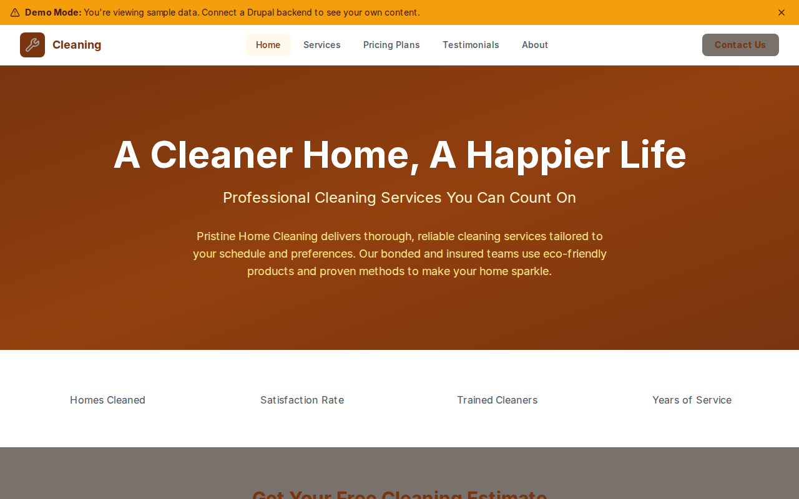

# Decoupled Cleaning

A cleaning service business website starter template for Decoupled Drupal + Next.js. Built for house cleaning companies, janitorial services, and maid service providers.



## Features

- **Service Listings** - Standard cleaning, deep cleaning, and move-in/move-out services with pricing and inclusions
- **Pricing Plans** - Tiered pricing packages (Basic, Premium, Luxury) with feature comparisons and home size ranges
- **Customer Testimonials** - Client reviews with ratings, photos, and service type details
- **Modern Design** - Clean, accessible UI optimized for service business content

## Quick Start

### 1. Clone the template

```bash
npx degit nextagencyio/decoupled-cleaning my-cleaning
cd my-cleaning
npm install
```

### 2. Run interactive setup

```bash
npm run setup
```

This interactive script will:
- Authenticate with Decoupled.io (opens browser)
- Create a new Drupal space
- Wait for provisioning (~90 seconds)
- Configure your `.env.local` file
- Import sample content

### 3. Start development

```bash
npm run dev
```

Visit [http://localhost:3000](http://localhost:3000)

---

## Manual Setup

<details>
<summary>Click to expand manual setup steps</summary>

### Authenticate with Decoupled.io

```bash
npx decoupled-cli@latest auth login
```

### Create a Drupal space

```bash
npx decoupled-cli@latest spaces create "My Cleaning Service"
```

Note the space ID returned. Wait ~90 seconds for provisioning.

### Configure environment

```bash
npx decoupled-cli@latest spaces env 1234 --write .env.local
```

### Import content

```bash
npm run setup-content
```

This imports:
- Homepage with statistics and call to action
- 3 Cleaning Services (Standard, Deep, Move-In/Move-Out)
- 3 Pricing Plans (Basic, Premium, Luxury)
- 3 Customer Testimonials
- 2 Static Pages (About, Contact)

</details>

## Content Types

### Service
- **Summary** - Short description of the service
- **Starting Price** - Base price for the service
- **Frequency Options** - Available scheduling options (weekly, bi-weekly, monthly, one-time)
- **What's Included** - List of tasks covered in the service
- **Service Image** - Photo illustrating the service

### Pricing Plan
- **Price** - Cost per visit
- **Billing Period** - How often billing occurs
- **Plan Features** - List of features included in the plan
- **Most Popular** - Flag for highlighting the recommended plan
- **Home Size** - Square footage range the plan covers
- **Plan Image** - Photo for the plan

### Testimonial
- **Client Name** - Customer name
- **Client Location** - Where the customer is located
- **Rating** - Star rating (1-5)
- **Service Type** - Which service or plan the customer uses
- **Client Photo** - Customer headshot

### Basic Page
- Static content pages (About, Contact, etc.)

## Customization

### Colors & Branding
Edit `tailwind.config.js` to customize colors, fonts, and spacing.

### Content Structure
Modify `data/cleaning-content.json` to add or change content types and sample content.

### Components
React components are in `app/components/`. Update them to match your design needs.

## Demo Mode

Demo mode allows you to showcase the application without connecting to a Drupal backend.

### Enable Demo Mode

```bash
NEXT_PUBLIC_DEMO_MODE=true
```

### Removing Demo Mode

1. Delete `lib/demo-mode.ts`
2. Delete `data/mock/` directory
3. Delete `app/components/DemoModeBanner.tsx`
4. Remove `DemoModeBanner` from `app/layout.tsx`
5. Remove demo mode checks from `app/api/graphql/route.ts`

## Deployment

### Vercel (Recommended)
[](https://vercel.com/new/clone?repository-url=https://github.com/nextagencyio/decoupled-cleaning)

### Other Platforms
Works with any Node.js hosting platform that supports Next.js.

## Documentation

- [Decoupled.io Docs](https://www.decoupled.io/docs)
- [Next.js Documentation](https://nextjs.org/docs)
- [Drupal GraphQL](https://www.decoupled.io/docs/graphql)

## License

MIT
